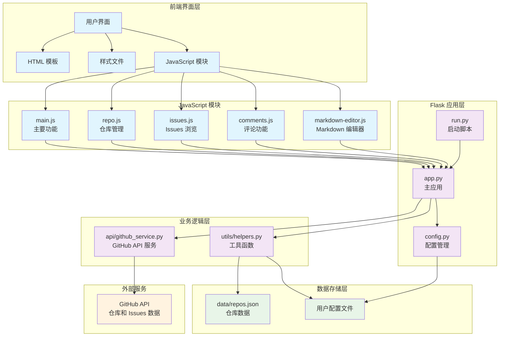

# HubNote 应用功能详细说明文档

## 📋 项目概述

HubNote 是一个基于 Flask + JavaScript 的 GitHub Issues 管理工具，帮助用户更好地跟踪和管理多个仓库的 Issues。项目采用前后端分离架构，支持打包为独立的 macOS 应用程序。

## 🏗️ 项目架构

```
gitnote/
├── app.py                 # Flask 应用主文件
├── config.py              # 配置文件
├── run.py                 # 应用启动脚本
├── requirements.txt       # Python 依赖
├── api/                   # GitHub API 服务
│   ├── __init__.py
│   └── github_service.py
├── utils/                 # 工具函数
│   ├── __init__.py
│   └── helpers.py
├── templates/             # HTML 模板
│   ├── base.html
│   ├── index.html
│   ├── issues.html
│   ├── issue_detail.html
│   ├── config.html
│   ├── 404.html
│   └── 500.html
├── static/                # 静态资源
│   ├── css/
│   │   └── main.css
│   ├── js/
│   │   ├── main.js
│   │   ├── repo.js
│   │   ├── issues.js
│   │   ├── comments.js
│   │   └── markdown-editor.js
│   └── images/
├── data/                  # 数据存储
│   └── repos.json
└── test_*.py             # 测试脚本
```

### 技术架构图



## 🐍 Python 后端模块详细分析

### 1. app.py - Flask 应用主文件

**主要功能：**
- Flask 应用工厂模式创建和配置
- 路由定义和请求处理
- 用户配置管理（GitHub Token）
- PyInstaller 打包支持

**核心函数：**

#### `create_app(config_name=None)`
- **功能**：应用工厂函数，创建和配置 Flask 应用实例
- **参数**：`config_name` - 配置环境名称
- **返回**：配置好的 Flask 应用实例
- **技术点**：模板文件夹配置、CORS 启用、模板过滤器注册

#### `get_resource_path(relative_path)`
- **功能**：获取资源文件的绝对路径，支持 PyInstaller 打包
- **参数**：`relative_path` - 相对路径
- **返回**：绝对路径字符串
- **技术点**：`sys._MEIPASS` 打包路径处理

#### `get_github_token()`
- **功能**：获取 GitHub Token，优先从用户配置读取，然后从环境变量读取
- **返回**：GitHub Token 字符串或 None
- **技术点**：配置文件读取、环境变量处理

**路由处理函数：**
- `index()`：主页 - 显示仓库列表
- `add_repository()`：添加仓库
- `remove_repository(repo_full_name)`：删除仓库
- `repo_issues(repo_full_name)`：显示仓库的 Issues
- `issue_detail(repo_full_name, issue_number)`：显示 Issue 详情

**API 路由：**
- `/api/repos`：获取仓库列表 API
- `/api/repo/<path:repo_full_name>/issues`：获取仓库 Issues API
- `/api/validate_token`：验证 GitHub Token
- `/api/config`：配置信息管理
- `/api/config/token`：保存 GitHub Token

**Python 知识点：**
- Flask 框架：路由装饰器、模板渲染、请求处理
- 文件系统操作：`os.path`、`pathlib.Path`
- JSON 数据处理
- 异常处理和错误页面
- CORS 跨域处理

### 2. config.py - 配置文件

**主要功能：**
- 应用配置管理
- 环境变量加载
- 不同环境配置（开发/生产）

**核心类：**

#### `Config` 基础配置类
- **属性**：
  - `GITHUB_TOKEN`：GitHub Personal Access Token
  - `SECRET_KEY`：Flask 密钥
  - `DEBUG`：调试模式开关
  - `REPOS_FILE`：仓库数据文件路径
  - `CACHE_TIMEOUT`：缓存超时时间
  - `ISSUES_PER_PAGE`：每页 Issues 数量
  - `API_RATE_LIMIT`：API 请求限制

#### `DevelopmentConfig` / `ProductionConfig`
- **功能**：继承基础配置，针对不同环境的特定配置
- **区别**：主要在 DEBUG 模式的开启/关闭

**Python 知识点：**
- 类继承和静态方法
- 环境变量处理（`python-dotenv`）
- 配置模式设计

### 3. api/github_service.py - GitHub API 服务

**主要功能：**
- GitHub API 交互封装
- 仓库信息获取
- Issues 和评论管理
- Token 验证

**核心类和方法：**

#### `GitHubService` 类
```python
def __init__(self, token=None):
    self.token = token
    self.github = Github(token) if token else Github()
    self.session = requests.Session()
```

#### `validate_token(self)`
- **功能**：验证 GitHub Token 是否有效
- **返回**：`(bool, str)` - 验证结果和用户名或错误信息
- **技术点**：PyGithub 库使用、异常处理

#### `get_repo_info(self, repo_url)`
- **功能**：获取仓库基本信息
- **参数**：`repo_url` - GitHub 仓库 URL 或 owner/repo 格式
- **返回**：包含仓库详细信息的字典
- **处理**：URL 解析、仓库名提取、错误信息本地化

#### `get_issues(self, repo_full_name, state='all', page=1, per_page=20)`
- **功能**：获取仓库的 Issues 列表
- **参数**：
  - `repo_full_name`：仓库全名
  - `state`：Issues 状态（all/open/closed）
  - `page`：页码
  - `per_page`：每页数量
- **返回**：Issues 列表和总数
- **技术点**：分页处理、Pull Request 过滤

#### CRUD 操作方法
- `update_issue(repo_full_name, issue_number, body)`：更新 Issue 内容
- `create_comment(repo_full_name, issue_number, body)`：创建新评论
- `update_comment(repo_full_name, comment_id, body)`：更新评论内容
- `delete_comment(repo_full_name, comment_id)`：删除评论
- `get_issue_comments(repo_full_name, issue_number)`：获取 Issue 的所有评论
- `get_issue_detail(repo_full_name, issue_number)`：获取 Issue 详细信息

**Python 知识点：**
- HTTP 请求处理（`requests` 库）
- GitHub API 集成（`PyGithub` 库）
- 异常处理和错误信息格式化
- 日期时间处理
- 分页数据处理

### 4. utils/helpers.py - 工具函数

**主要功能：**
- 数据持久化（JSON 文件）
- 日期时间格式化
- Markdown 渲染
- 文本处理工具

**核心函数：**

#### 数据管理函数
- `load_repos()`：从 JSON 文件加载仓库列表
- `save_repos(repos_data)`：保存仓库列表到 JSON 文件
- `add_repo(repo_info)`：添加仓库到列表
- `remove_repo(repo_full_name)`：从列表中移除仓库

#### 格式化函数
- `format_datetime(iso_string)`：将 ISO 格式时间转换为相对时间（如"3小时前"）
- `render_markdown(text)`：将 Markdown 文本转换为 HTML
- `truncate_text(text, max_length=100)`：截断文本并添加省略号
- `get_label_style(color)`：根据标签颜色生成 CSS 样式

**Python 知识点：**
- 文件 I/O 操作
- JSON 序列化/反序列化
- 正则表达式（`re` 模块）
- Markdown 处理（`markdown` 库）
- 颜色计算和 CSS 样式生成

### 5. run.py - 应用启动脚本

**主要功能：**
- 命令行参数解析
- 应用启动配置
- 开发/生产环境适配

**核心函数：**

#### `main()`
- **功能**：主函数，解析命令行参数并启动应用
- **参数处理**：
  - `--host`：监听地址（默认 127.0.0.1）
  - `--port`：监听端口（默认 5000，打包后 5001）
  - `--debug`：调试模式开关
- **初始化**：创建必要目录、检查数据文件

**Python 知识点：**
- `argparse` 命令行参数处理
- 系统路径操作
- 条件启动逻辑

### 6. test_github_token.py - Token 测试脚本

**主要功能：**
- GitHub Token 有效性验证
- API 权限测试
- 诊断信息输出

**核心函数：**

#### `test_github_token()`
- **功能**：测试 GitHub Token 的有效性和权限
- **测试项目**：
  1. Token 基本信息验证
  2. API 访问权限测试
  3. 速率限制检查
- **输出**：详细的测试结果和诊断信息

**Python 知识点：**
- HTTP API 测试
- 错误诊断和用户友好提示

## 🌐 JavaScript 前端模块详细分析

### 1. static/js/main.js - 主要 JS 功能

**主要功能：**
- 应用初始化
- 通用 UI 交互
- 工具函数库

**核心函数：**

#### `initApp()`
- **功能**：应用初始化，设置全局事件监听器
- **初始化项目**：
  - 自动关闭 flash 消息
  - 工具提示初始化
  - 表单验证初始化

#### `autoCloseFlashMessages()`
- **功能**：自动关闭提示消息
- **技术点**：CSS 动画、定时器、DOM 操作

#### `initTooltips()`
- **功能**：初始化工具提示功能
- **实现**：鼠标悬停显示、动态定位

#### `validateForm(event)`
- **功能**：表单验证
- **验证项目**：
  - 必填字段检查
  - 仓库 URL 格式验证
- **技术点**：正则表达式、事件处理

#### 工具函数
- `formatDate(dateString)`：日期格式化
- `truncateText(text, maxLength)`：文本截断
- `apiCall(url, options)`：API 调用封装
- `showLoading(element)` / `hideLoading(element)`：加载状态管理
- `showNotification(message, type)`：通知显示
- `copyToClipboard(text)`：复制到剪贴板

**JavaScript 知识点：**
- DOM 操作和事件处理
- 异步编程（Promise、async/await）
- 表单验证
- CSS 动画控制
- 模块化设计（window.HubNote 命名空间）

### 2. static/js/repo.js - 仓库管理功能

**主要功能：**
- 仓库添加/删除
- 仓库搜索和排序
- 统计信息显示

**核心函数：**

#### `initRepoPage()`
- **功能**：仓库页面初始化
- **初始化项目**：
  - 添加仓库表单
  - 删除仓库功能
  - 搜索功能
  - 排序功能
  - 统计信息加载

#### `addRepository(repoUrl)`
- **功能**：添加仓库
- **流程**：
  1. 表单验证
  2. 发送 POST 请求到 `/add_repo`
  3. 处理响应和错误
  4. 更新界面状态
- **技术点**：Fetch API、错误处理、状态管理

#### `deleteRepository(repoName)`
- **功能**：删除仓库
- **流程**：
  1. 用户确认对话框
  2. 发送删除请求
  3. 更新界面
- **技术点**：确认对话框、DOM 更新

#### `filterRepositories(searchTerm)`
- **功能**：仓库搜索筛选（纯前端）
- **搜索范围**：仓库名、描述、语言
- **技术点**：文本匹配、DOM 显示/隐藏

#### `sortRepositories(sortBy)`
- **功能**：仓库排序（纯前端）
- **排序选项**：名称、星标数、更新时间、添加时间
- **技术点**：数组排序、DOM 重排

#### `loadRepoStats()`
- **功能**：加载仓库统计信息
- **统计项目**：总仓库数、总星标数、语言分布
- **技术点**：数据聚合、图表显示

**JavaScript 知识点：**
- Fetch API 使用
- 数组操作和排序
- 动态 DOM 更新
- 用户确认对话框
- 数据统计和可视化

### 3. static/js/issues.js - Issues 页面功能

**主要功能：**
- Issues 筛选（状态、标签）
- Issues 搜索
- 分页处理
- 统计信息

**核心函数：**

#### `initIssuesPage()`
- **功能**：Issues 页面初始化
- **初始化项目**：
  - 筛选器
  - 搜索功能
  - 排序功能
  - 分页
  - Issue 交互
  - 统计信息

#### `filterIssues(filterType)`
- **功能**：按状态筛选 Issues
- **筛选类型**：all（全部）、open（开放）、closed（已关闭）
- **技术点**：DOM 元素显示/隐藏、计数更新

#### `searchIssues(searchTerm)`
- **功能**：Issues 搜索（实时搜索）
- **搜索范围**：标题、内容、作者、标签
- **技术点**：防抖处理、文本匹配、高亮显示

#### `sortIssues(sortBy)`
- **功能**：Issues 排序
- **排序选项**：创建时间、更新时间、标题、评论数
- **技术点**：多字段排序、DOM 重排

#### `loadPage(page)`
- **功能**：分页数据加载
- **实现**：
  1. 发送 API 请求
  2. 更新 Issues 列表
  3. 更新分页导航
- **技术点**：异步数据加载、分页组件

#### `loadIssueStats()`
- **功能**：加载 Issues 统计信息
- **统计项目**：总数、开放数、关闭数、标签分布
- **技术点**：数据聚合、图表展示

**JavaScript 知识点：**
- 文本搜索算法
- 防抖（debounce）技术
- 分页逻辑实现
- 数据统计和可视化
- 实时筛选和搜索

### 4. static/js/comments.js - 评论功能

**主要功能：**
- 评论展开/折叠
- 代码高亮
- 图片预览
- 评论筛选和搜索

**核心函数：**

#### `initCommentsPage()`
- **功能**：评论页面初始化
- **初始化项目**：
  - 评论交互
  - 代码高亮
  - 图片预览
  - 链接处理
  - 评论筛选
  - 评论搜索
  - 统计信息

#### `initCommentInteractions()`
- **功能**：初始化评论交互
- **功能包括**：
  - 长评论展开/折叠
  - 评论操作菜单
  - 回复功能
- **技术点**：动态按钮添加、菜单控制

#### `initCodeHighlight()`
- **功能**：代码块高亮和功能增强
- **增强功能**：
  - 语法高亮
  - 复制按钮
  - 语言标签
- **技术点**：代码块识别、语法高亮库集成

#### `showImageModal(src, alt)`
- **功能**：图片预览模态框
- **功能**：
  - 全屏图片查看
  - 缩放控制
  - 键盘导航
- **技术点**：模态框实现、图片缩放

#### `filterComments(filterType)`
- **功能**：评论筛选
- **筛选类型**：全部、作者评论、其他用户评论
- **技术点**：条件筛选、动态显示

#### `searchComments(searchTerm)`
- **功能**：评论搜索
- **搜索范围**：评论内容、作者
- **技术点**：文本匹配、高亮显示

**JavaScript 知识点：**
- 模态框实现
- 代码语法高亮
- 图片懒加载
- 滚动定位
- 复制到剪贴板功能
- 键盘事件处理

### 5. static/js/markdown-editor.js - Markdown 编辑器

**主要功能：**
- Markdown 编辑和预览
- 工具栏功能
- 实时预览
- 评论编辑

**核心函数：**

#### `initMarkdownEditor()`
- **功能**：Markdown 编辑器初始化
- **初始化项目**：
  - Issue 编辑功能
  - 评论编辑功能
  - 添加评论编辑器
  - 标签页切换
  - Markdown 工具栏

#### Issue 编辑功能
- `showIssueEditor()`：显示 Issue 编辑器
- `hideIssueEditor()`：隐藏 Issue 编辑器
- `updateIssuePreview()`：更新 Issue 预览
- `saveIssueChanges()`：保存 Issue 修改

#### 评论编辑功能
- `showCommentEditor(commentIndex)`：显示评论编辑器
- `hideCommentEditor(commentIndex)`：隐藏评论编辑器
- `updateCommentPreview(commentIndex)`：更新评论预览
- `saveCommentChanges(commentIndex, commentId)`：保存评论修改

#### 添加评论功能
- `initAddCommentEditor()`：初始化添加评论编辑器
- `switchAddCommentTab(tabType)`：切换编辑/预览标签页
- `updateAddCommentPreview()`：更新添加评论预览
- `submitNewComment()`：提交新评论

#### Markdown 工具栏
- `initMarkdownToolbar()`：初始化工具栏
- `applyMarkdownFormat(textarea, action)`：应用 Markdown 格式
- **支持格式**：粗体、斜体、代码、链接、列表、引用等

#### 标签页切换
- `switchTab(container, tabType)`：通用标签页切换
- **标签页类型**：write（编辑）、preview（预览）

**JavaScript 知识点：**
- 富文本编辑器实现
- 标签页切换
- 键盘快捷键处理
- Markdown 语法处理
- 实时预览技术
- 文本选择和插入
- API 调用和错误处理

## 🎨 模板文件分析

### templates/base.html - 基础模板
- **功能**：定义页面基础结构
- **包含**：导航栏、主内容区、页脚、Flash 消息显示
- **技术点**：Jinja2 模板继承、块定义

### templates/index.html - 主页模板
- **功能**：显示仓库列表
- **特性**：仓库卡片、统计信息、添加仓库表单

### templates/issues.html - Issues 列表页面
- **功能**：显示仓库的 Issues 列表
- **特性**：筛选器、搜索框、分页导航

### templates/issue_detail.html - Issue 详情页面
- **功能**：显示 Issue 详细内容和评论
- **特性**：Markdown 渲染、评论列表、编辑功能

### templates/config.html - 配置页面
- **功能**：GitHub Token 配置
- **特性**：Token 验证、用户信息显示

## 🎯 核心功能模块

### 1. 仓库管理模块
- **后端**：`GitHubService.get_repo_info()`
- **前端**：`repo.js`
- **功能**：添加、删除、搜索、排序仓库

### 2. Issues 浏览模块
- **后端**：`GitHubService.get_issues()`
- **前端**：`issues.js`
- **功能**：筛选、搜索、分页、详情查看

### 3. 评论系统模块
- **后端**：`GitHubService` 评论相关方法
- **前端**：`comments.js`、`markdown-editor.js`
- **功能**：查看、编辑、添加、删除评论

### 4. Markdown 支持模块
- **后端**：`utils.helpers.render_markdown()`
- **前端**：`markdown-editor.js`
- **功能**：编辑器、预览、语法高亮

### 5. 用户配置模块
- **后端**：`app.py` 配置相关函数
- **前端**：配置页面 JavaScript
- **功能**：GitHub Token 管理

### 6. 数据持久化模块
- **后端**：`utils.helpers` 数据管理函数
- **存储**：JSON 文件
- **功能**：仓库列表存储、配置保存

## 🔧 技术栈总结

### 后端 Python 技术
- **Flask**：Web 应用框架
- **PyGithub**：GitHub API 集成
- **Requests**：HTTP 请求处理
- **Markdown**：文本渲染
- **Python-dotenv**：环境变量管理
- **Flask-CORS**：跨域处理

### 前端 JavaScript 技术
- **原生 JavaScript**：DOM 操作、事件处理
- **Fetch API**：异步数据请求
- **CSS3**：动画和响应式设计
- **Markdown 渲染**：实时预览
- **模块化设计**：命名空间管理

### 开发和部署
- **PyInstaller**：应用打包
- **虚拟环境**：依赖隔离
- **Shell 脚本**：自动化构建
- **JSON**：数据存储格式

## 🚀 应用特性

1. **多仓库管理**：支持添加和管理多个 GitHub 仓库
2. **Issues 浏览**：查看仓库的所有 Issues，支持筛选和搜索
3. **评论查看**：查看 Issue 的详细内容和所有评论
4. **标签支持**：显示 Issue 标签，支持按标签筛选
5. **统计信息**：显示仓库和 Issues 的统计数据
6. **现代界面**：简洁美观的用户界面
7. **响应式设计**：支持桌面和移动设备
8. **Markdown 支持**：完整的 Markdown 编辑和预览功能
9. **实时搜索**：支持实时搜索和筛选
10. **应用打包**：支持打包为独立的 macOS 应用程序

## 📈 架构优势

1. **前后端分离**：清晰的职责划分，便于维护和扩展
2. **模块化设计**：每个功能模块独立，代码组织清晰
3. **错误处理**：完善的错误处理和用户友好的提示
4. **性能优化**：防抖搜索、分页加载、缓存机制
5. **用户体验**：实时预览、快捷键支持、响应式设计
6. **可扩展性**：易于添加新功能和集成其他服务

这个项目展现了现代 Web 应用开发的完整流程，从后端 API 设计到前端用户交互，涵盖了 Python Web 开发和 JavaScript 前端开发的核心技术点。